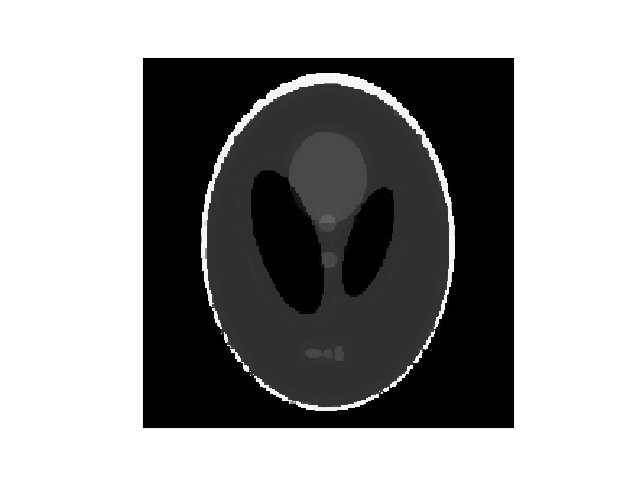

# Getting Started

To get familiar with the different aspects of RegularizedLeastSquares.jl, we will go through a simple example from the field of Compressed Sensing.

In Addtion to RegularizedLeastSquares.jl, we will need the packages LinearOperatorCollection.jl, Images.jl and Random.jl, as well as PyPlot for visualization.

```julia
using RegularizedLeastSquares, LinearOperatorCollection, Images, PyPlot, Random
```

To get started, let us generate a simple phantom
```julia
N = 256
I = shepp_logan(N)
```

In this example, we consider an operator which randomly samples half of the pixels in the image. Such an operator and the corresponding measurement can be generated by calling

```julia
# sampling operator
idx = sort( shuffle( collect(1:N^2) )[1:div(N^2,2)] )
A = SamplingOp(eltype(I), pattern = idx , shape = (N,N))

# generate undersampled data
y = A*vec(I)
```

To recover the image, we solve the TV-regularized least squares problem
```math
\begin{equation}
  \underset{\mathbf{x}}{argmin} \frac{1}{2}\vert\vert \mathbf{A}\mathbf{x}-\mathbf{y} \vert\vert_2^2 + λTV(\mathbf{x}) .
\end{equation}
```

For this purpose we build a TV regularizer with regularization parameter $λ=0.01$
```julia
reg = TVRegularization(0.01; shape=(N,N))
```

To solve the CS problem, the Alternating Direction Method of Multipliers can be used. Thus, we build the corresponding solver
```julia
solver = createLinearSolver(ADMM, A; reg=reg, ρ=0.1, iterations=20)
```
and apply it to our measurement
```julia
Ireco = solve(solver,y)
Ireco = reshape(Ireco,N,N)
```

The original phantom and the reconstructed image are shown below



